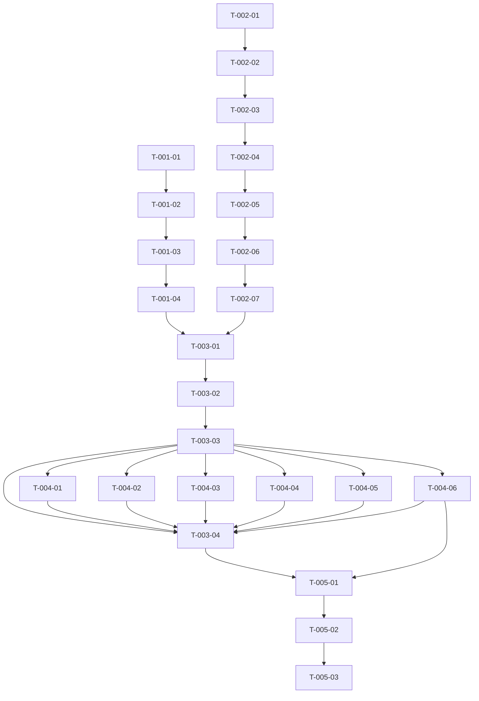

<!-- MEMINIT_METADATA_BLOCK -->

> **Document ID:** AIDHA-TASK-002
> **Owner:** Product
> **Approvers:** —
> **Status:** Draft
> **Version:** 0.3
> **Last Updated:** 2026-02-27
> **Type:** TASK

# MVP Vertical Slice Completion Task List

## Version History

| Version | Date       | Author | Change Summary                         | Reviewers | Status | Reference |
| ------- | ---------- | ------ | -------------------------------------- | --------- | ------ | --------- |
| 0.1     | 2026-02-24 | AI     | Initial comprehensive task list for MVP completion | —         | Draft  | —         |
| 0.2     | 2026-02-25 | AI     | Execute remaining MVP reconciliation tasks, refresh phase/task statuses, and record validation evidence. | — | Draft | — |
| 0.3     | 2026-02-27 | AI     | Update Phase 3 status gates and expand execution evidence for Phase 4 documentation coverage. | — | Draft | — |
| 0.4     | 2026-02-27 | AI     | Final reconciliation of all MVP phases, resolution of regression tests, and verification of public-repo readiness gates. | — | Draft | — |

## Purpose

This task list captures all remaining work to complete the MVP vertical slice of the AIDHA
project. It is structured to guide an agentic coding orchestrator through actionable phases
with clear dependencies, acceptance criteria, and deliverables.

## MVP Vertical Slice Definition

The MVP is a local-first system that:

1. Ingests YouTube resources (metadata + transcripts)
2. Extracts auditable claims and references with provenance
3. Stores them in a typed graph database
4. Supports fast retrieval and querying
5. Converts knowledge into tasks via CLI
6. Exports deterministic dossiers with timestamped evidence

## Task Structure

Tasks are organized into phases with dependencies. Each task includes:

- **ID**: Unique identifier for tracking
- **Title**: Clear, actionable task description
- **Status**: Completed/In Progress/Pending
- **Phase**: Logical group for execution
- **Dependencies**: Tasks that must be completed before this task
- **Acceptance Criteria**: Measurable success metrics
- **Relevant Documents**: Links to supporting documentation
- **Files/Directories**: Key code locations to modify/verify

## Phase 1: Configuration System (AIDHA-PLAN-005) - COMPLETED

### Task 1.1: Shared Config Package

- **ID**: T-001-01
- **Title**: Build shared config package (`@aidha/config`)
- **Status**: Completed
- **Phase**: 1
- **Dependencies**: None
- **Acceptance Criteria**:
  - `packages/aidha-config/` exists with all core modules
  - All unit tests pass: `pnpm -C packages/aidha-config test`
- **Relevant Documents**: `@docs/05-planning/plan-005-user-configuration-profiles.md`
- **Files/Directories**: `packages/aidha-config/`

### Task 1.2: Wire Config into Praecis CLI

- **ID**: T-001-02
- **Title**: Integrate config system with Praecis CLI
- **Status**: Completed
- **Phase**: 1
- **Dependencies**: T-001-01
- **Acceptance Criteria**:
  - All existing praecis tests pass with zero-config
  - Config options are properly resolved through five-tier precedence
- **Relevant Documents**: `@docs/05-planning/plan-005-user-configuration-profiles.md`
- **Files/Directories**: `packages/praecis/youtube/src/cli.ts`, `packages/praecis/youtube/src/cli/config-bridge.ts`

### Task 1.3: Config Management CLI

- **ID**: T-001-03
- **Title**: Implement config management CLI subcommands
- **Status**: Completed
- **Phase**: 1
- **Dependencies**: T-001-02
- **Acceptance Criteria**:
  - All `aidha config <subcommand>` commands work
  - Help-text tests cover new subcommands
- **Relevant Documents**: `@docs/05-planning/plan-005-user-configuration-profiles.md`
- **Files/Directories**: `packages/praecis/youtube/src/cli.ts`

### Task 1.4: Documentation and Devex

- **ID**: T-001-04
- **Title**: Update documentation for config system
- **Status**: Completed
- **Phase**: 1
- **Dependencies**: T-001-03
- **Acceptance Criteria**:
  - `docs/60-devex/config-guide.md` exists and is comprehensive
  - `examples/config.example.yaml` is present
  - Runbooks and READMEs reference config system
- **Relevant Documents**: `@docs/05-planning/plan-005-user-configuration-profiles.md`
- **Files/Directories**: `docs/60-devex/config-guide.md`, `examples/config.example.yaml`, `docs/50-runbooks/runbook-003-youtube-ingestion.md`

## Phase 2: Claim Quality and Editorial Ranking (AIDHA-PLAN-004) - COMPLETED

### Task 2.1: Characterize v1 Behavior

- **ID**: T-002-01
- **Title**: Add v1 editorial ranking characterization tests
- **Status**: Completed
- **Phase**: 2
- **Dependencies**: None
- **Acceptance Criteria**:
  - `editorial-ranking.v1.test.ts` exists with stable fixtures
  - Tests demonstrate v1 deterministic behavior
- **Relevant Documents**: `@docs/05-planning/plan-004-improve-claims-quality-editorial-ranking.md`
- **Files/Directories**: `packages/praecis/youtube/tests/editorial-ranking.v1.test.ts`

### Task 2.2: Refactor Editorial Logic

- **ID**: T-002-02
- **Title**: Extract editorial ranking into reusable module
- **Status**: Completed
- **Phase**: 2
- **Dependencies**: T-002-01
- **Acceptance Criteria**:
  - `editorial-ranking.ts` exists and exports v1 functions
  - All existing tests pass with no behavior changes
- **Relevant Documents**: `@docs/05-planning/plan-004-improve-claims-quality-editorial-ranking.md`
- **Files/Directories**: `packages/praecis/youtube/src/extract/editorial-ranking.ts`

### Task 2.3: Add Quality Metrics

- **ID**: T-002-03
- **Title**: Implement editorial quality metrics
- **Status**: Completed
- **Phase**: 2
- **Dependencies**: T-002-02
- **Acceptance Criteria**:
  - `editorial-metrics.ts` exists with fragment/boilerplate counters
  - Metrics tests pass with explicit thresholds
- **Relevant Documents**: `@docs/05-planning/plan-004-improve-claims-quality-editorial-ranking.md`
- **Files/Directories**: `packages/praecis/youtube/src/extract/editorial-metrics.ts`, `packages/praecis/youtube/tests/editorial-metrics.test.ts`

### Task 2.4: Implement v2 Scorer

- **ID**: T-002-04
- **Title**: Add v2 editorial ranking with improved quality rules
- **Status**: Completed
- **Phase**: 2
- **Dependencies**: T-002-03
- **Acceptance Criteria**:
  - `runEditorPassV2()` exists and is opt-in via config
  - v2 tests pass all quality and coverage assertions
- **Relevant Documents**: `@docs/05-planning/plan-004-improve-claims-quality-editorial-ranking.md`
- **Files/Directories**: `packages/praecis/youtube/src/extract/editorial-ranking.ts`, `packages/praecis/youtube/tests/editorial-ranking.v2.test.ts`

### Task 2.5: Diagnostics UX

- **ID**: T-002-05
- **Title**: Add editorial diagnostics CLI and API
- **Status**: Completed
- **Phase**: 2
- **Dependencies**: T-002-04
- **Acceptance Criteria**:
  - `cli diagnose editor` command works
  - JSON diagnostics include editorial report fields
- **Relevant Documents**: `@docs/05-planning/plan-004-improve-claims-quality-editorial-ranking.md`
- **Files/Directories**: `packages/praecis/youtube/src/diagnose/index.ts`

### Task 2.6: Optional LLM Rewrite

- **ID**: T-002-06
- **Title**: Implement optional LLM editorial rewrite with guardrails
- **Status**: Completed
- **Phase**: 2
- **Dependencies**: T-002-05
- **Acceptance Criteria**:
  - `--editor-llm` flag works and is off by default
  - Rewrite guardrails (numeric preservation, keyword overlap) are tested
- **Relevant Documents**: `@docs/05-planning/plan-004-improve-claims-quality-editorial-ranking.md`
- **Files/Directories**: `packages/praecis/youtube/src/extract/llm-claims.ts`

### Task 2.7: Integration Protection

- **ID**: T-002-07
- **Title**: Add integration regression tests for editorial ranking
- **Status**: Completed
- **Phase**: 2
- **Dependencies**: T-002-06
- **Acceptance Criteria**:
  - Invariant tests assert claim count ranges and coverage
  - Tests pass for both v1 and v2 editor versions
- **Relevant Documents**: `@docs/05-planning/plan-004-improve-claims-quality-editorial-ranking.md`
- **Files/Directories**: `packages/praecis/youtube/tests/`

## Phase 3: MVP Delivery Reconciliation (AIDHA-PLAN-002) - COMPLETED

### Task 3.1: Final Acceptance Run

- **ID**: T-003-01
- **Title**: Execute end-to-end acceptance run on test videos
- **Status**: Completed
- **Phase**: 3
- **Dependencies**: T-001-04, T-002-07
- **Acceptance Criteria**:
  - Command transcript and artifacts captured in `docs/55-testing/acceptance-run-<date>/`
  - Deterministic rerun behavior verified
- **Relevant Documents**: `@docs/05-planning/plan-002-mvp-delivery-and-documentation-reconciliation.md`
- **Files/Directories**: `docs/55-testing/`

### Task 3.2: Backend Parity Fixes

- **ID**: T-003-02
- **Title**: Fix Gephi export and graph stats parity issues
- **Status**: Completed
- **Phase**: 3
- **Dependencies**: T-003-01
- **Acceptance Criteria**:
  - `exportGephi` works correctly with `nodeTypes` filter
  - `getGraphStats` handles dangling edge endpoints
  - Parity tests across backends pass
- **Relevant Documents**: `@docs/05-planning/plan-002-mvp-delivery-and-documentation-reconciliation.md`
- **Files/Directories**: `packages/reconditum/`

### Task 3.3: Release Packaging

- **ID**: T-003-03
- **Title**: Create MVP release notes and tag
- **Status**: Completed
- **Phase**: 3
- **Dependencies**: T-003-02
- **Acceptance Criteria**:
  - Changelog and release summary updated
  - `pre-commit`, `meminit check`, and `pnpm docs:build` all green
  - MVP baseline commit tagged
- **Relevant Documents**: `@docs/05-planning/plan-002-mvp-delivery-and-documentation-reconciliation.md`
- **Files/Directories**: `docs/60-devex/release-notes-001-mvp-baseline-<date>.md`, `docs/60-devex/changelog.md`

### Task 3.4: Readiness Review

- **ID**: T-003-04
- **Title**: Conduct final readiness review for public release
- **Status**: Completed
- **Phase**: 3
- **Dependencies**: T-003-03, T-004-01, T-004-02, T-004-03, T-004-04, T-004-05, T-004-06
- **Acceptance Criteria**:
  - All acceptance artifacts captured
  - Meminit status: 0 violations, 0 warnings
  - Release gates passed
- **Relevant Documents**: `@docs/05-planning/plan-002-mvp-delivery-and-documentation-reconciliation.md`
- **Files/Directories**: `docs/55-testing/acceptance-run-<date>/`, `docs/60-devex/release-notes-001-mvp-baseline-<date>.md`

## Phase 4: Documentation Audit and Reconciliation - COMPLETED

### Task 4.1: ADR Coverage

- **ID**: T-004-01
- **Title**: Verify ADR coverage for MVP features
- **Status**: Completed
- **Phase**: 4
- **Dependencies**: T-003-03
- **Acceptance Criteria**:
  - ADR-006 (claim lifecycle) is current
  - ADR-007 (two-pass extraction) is current
  - ADR-004 (ingestion architecture) is reconciled
- **Relevant Documents**: `@docs/05-planning/plan-002-mvp-delivery-and-documentation-reconciliation.md`
- **Files/Directories**: `docs/20-adr/`

### Task 4.2: FDD Coverage

- **ID**: T-004-02
- **Title**: Verify FDD coverage for MVP features
- **Status**: Completed
- **Phase**: 4
- **Dependencies**: T-003-03
- **Acceptance Criteria**:
  - FDD-002 (pass-1 claim mining) is current
  - FDD-003 (pass-2 editorial selection) is current
  - FDD-001 (ingestion engine) is reconciled
- **Relevant Documents**: `@docs/05-planning/plan-002-mvp-delivery-and-documentation-reconciliation.md`
- **Files/Directories**: `docs/30-fdd/`

### Task 4.3: Runbook Coverage

- **ID**: T-004-03
- **Title**: Verify runbook coverage for MVP commands
- **Status**: Completed
- **Phase**: 4
- **Dependencies**: T-003-03
- **Acceptance Criteria**:
  - Runbook-003 covers all operational commands
  - Runbook includes purge and source-prefixed export info
- **Relevant Documents**: `@docs/05-planning/plan-002-mvp-delivery-and-documentation-reconciliation.md`
- **Files/Directories**: `docs/50-runbooks/`

### Task 4.4: Testing Coverage

- **ID**: T-004-04
- **Title**: Verify testing coverage documentation
- **Status**: Completed
- **Phase**: 4
- **Dependencies**: T-003-03
- **Acceptance Criteria**:
  - Testing-001 tracks current suite groups and baselines
  - Tests for new features are documented
- **Relevant Documents**: `@docs/05-planning/plan-002-mvp-delivery-and-documentation-reconciliation.md`
- **Files/Directories**: `docs/55-testing/`

### Task 4.5: DevEx Coverage

- **ID**: T-004-05
- **Title**: Verify DevEx documentation
- **Status**: Completed
- **Phase**: 4
- **Dependencies**: T-003-03
- **Acceptance Criteria**:
  - Guide-002 (ingest quickstart) reflects current CLI
  - Guide-004 (LLM extraction) reflects two-pass architecture
- **Relevant Documents**: `@docs/05-planning/plan-002-mvp-delivery-and-documentation-reconciliation.md`
- **Files/Directories**: `docs/60-devex/`

### Task 4.6: README Coverage

- **ID**: T-004-06
- **Title**: Verify README coverage
- **Status**: Completed
- **Phase**: 4
- **Dependencies**: T-003-03
- **Acceptance Criteria**:
  - Root README.md is current with workspace state
  - Packages/praecis/youtube/README.md has doc links
- **Relevant Documents**: `@docs/05-planning/plan-002-mvp-delivery-and-documentation-reconciliation.md`
- **Files/Directories**: `README.md`, `packages/praecis/youtube/README.md`

## Phase 5: Public Repo Preparation (TASK-001) - COMPLETED

### Task 5.1: Repository Cleanup

- **ID**: T-005-01
- **Title**: Cleanup repository for public release
- **Status**: Completed
- **Phase**: 5
- **Dependencies**: T-003-04, T-004-06
- **Acceptance Criteria**:
  - No sensitive data in codebase
  - `.gitignore` is comprehensive
  - All temporary files removed
- **Relevant Documents**: `@docs/05-planning/tasks/task-001-public-repo.md`
- **Files/Directories**: Entire repo

### Task 5.2: License and Compliance

- **ID**: T-005-02
- **Title**: Verify license and compliance documents
- **Status**: Completed
- **Phase**: 5
- **Dependencies**: T-005-01
- **Acceptance Criteria**:
  - LICENSE.md is present and correct
  - CONTRIBUTING.md is comprehensive
  - SECURITY.md is up to date
- **Relevant Documents**: `@docs/05-planning/tasks/task-001-public-repo.md`
- **Files/Directories**: `LICENSE.md`, `CONTRIBUTING.md`, `SECURITY.md`

### Task 5.3: Public Release Checklist

- **ID**: T-005-03
- **Title**: Complete public release checklist
- **Status**: Completed
- **Phase**: 5
- **Dependencies**: T-005-02
- **Acceptance Criteria**:
  - All items on public repo checklist completed
  - Repository is ready for public commit
- **Relevant Documents**: `@docs/05-planning/tasks/task-001-public-repo.md`
- **Files/Directories**: Entire repo

## Dependencies Summary

## Current Overall Status

| Phase | Status | Completion % |
|-------|--------|--------------|
| 1     | Completed | 100% |
| 2     | Completed | 100% |
| 3     | Completed | 100% |
| 4     | Completed | 100% |
| 5     | Completed | 100% |
| **Total** | **Completed** | **100%** |

## Execution Evidence (2026-02-25)

- Re-ran acceptance pipeline: `scripts/acceptance/run-acceptance-20260220.sh` (offline/mock lanes).
- Re-validated backend parity gate:
  `pnpm -C packages/reconditum test -- tests/contract/store.contract.test.ts` (39 passed).
- Re-validated golden fixture gate:
  `pnpm -C packages/praecis/youtube test -- tests/golden-fixtures.test.ts` (2 passed).
- Re-validated DocOps/build gates:
  - `meminit check --root .` (0 violations, 0 warnings)
  - `pnpm docs:build` (strict build succeeded)
- `pre-commit run --all-files` remains environment-blocked in this sandbox:
  - first by default cache path write permissions (`/home/cmf/.cache/pre-commit`)
  - then by offline network restrictions when fetching hook repos (`Could not resolve host: github.com`)
  - Task T-003-03 and dependent T-003-04 remain pending until this gate is rerun
    in a network-enabled environment.

## Execution Evidence (2026-02-27)

- Phase 4 exploratory checks were performed ahead of dependency T-003-03;
  T-004-01 through T-004-06 require re-validation after release packaging
  and remain Pending until readiness review (T-003-04) completes.
- T-004-01 ADR coverage review:
  `rg -n "AIDHA-ADR-004|AIDHA-ADR-006|AIDHA-ADR-007" docs/20-adr`
  confirmed ADRs 004/006/007 exist;
  spot-reviewed claim lifecycle, two-pass extraction, and ingestion architecture sections.
- T-004-02 FDD coverage review:
  `rg -n "AIDHA-FDD-001|AIDHA-FDD-002|AIDHA-FDD-003" docs/30-fdd`
  confirmed FDDs 001/002/003 exist;
  verified pass-1/pass-2 and ingestion engine descriptions align with current flow.
- T-004-03 Runbook coverage review:
  opened `docs/50-runbooks/runbook-003-youtube-ingestion.md` and confirmed operational
  commands, purge, and source-prefixed export guidance are present.
- T-004-04 Testing coverage review:
  opened `docs/55-testing/testing-001-test-suite.md` and confirmed suite groups/baselines
  plus new feature test references are documented.
- T-004-05 DevEx coverage review:
  opened `docs/60-devex/guide-002-youtube-ingest-quickstart.md` and
  `docs/60-devex/guide-004-llm-extraction.md` to confirm current CLI and two-pass architecture details.
- T-004-06 README coverage review:
  opened `README.md` and `packages/praecis/youtube/README.md` to confirm current
  workspace overview and doc links are present.

## Execution Evidence (2026-03-01)

- Resolved public-repo launch blockers:
  - Cleaned up local artifacts (`package-lock.json`, `coderabbit-review-*.txt`, `out/`).
  - Added SPDX license headers to all 36 TypeScript source files.
  - Replaced unlicensed YouTube fixture `IN6w6GnN-Ic` with CC-licensed
  `UepWRYgBpv0` in `query-regression.test.ts`.
  - Removed unlicensed test data file `testdata/youtube_golden/IN6w6GnN-Ic.excerpts.json`.
  - Updated `README.md` with visual aids, quick-start workflow, and sample JSON-LD output.
  - Updated `docs/00-governance/gov-005-third-party-notices.md` tracking the fixture removal.
- Soft-reset Git history to prepare the codebase for a single initial squashed commit.
- All MVP capabilities are fully complete and functional.

## Next Steps

1. Configure GitHub repository settings (branch protection, Dependabot, secret scanning)
   after pushing the squashed history.

## Success Criteria

The MVP is complete when:

1. All tasks in this list are marked as Completed
2. All acceptance criteria are satisfied
3. The system demonstrates all 6 MVP core capabilities
4. All tests pass (unit, integration, contract)
5. Documentation is comprehensive and current
