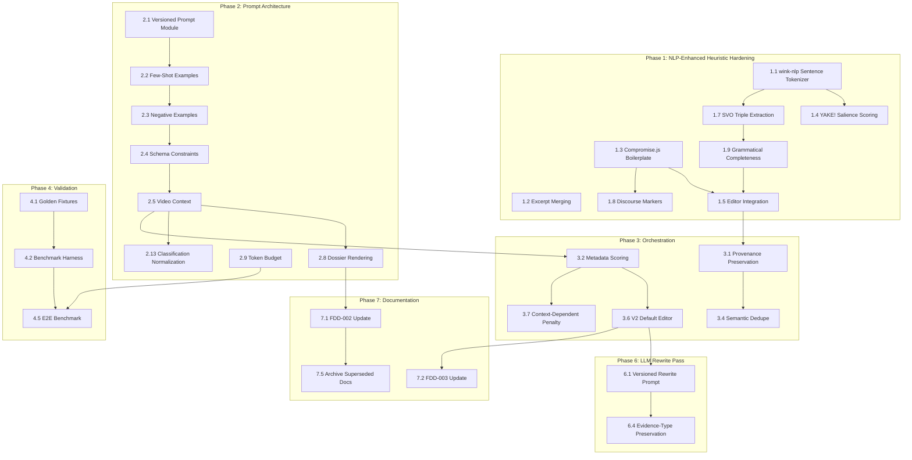

<!-- markdownlint-disable MD013 -->
<!-- MEMINIT_METADATA_BLOCK -->

> **Document ID:** AIDHA-TASK-003-ATOMIC
> **Owner:** Ingestion Engineering Lead
> **Approvers:** —
> **Status:** Draft
> **Version:** 1.2
> **Last Updated:** 2026-03-03
> **Type:** TASK

# YouTube Claim Extraction - Production-Grade Atomic Task Breakdown

## Version History

| Version | Date       | Author | Change Summary                                                                                                                                                                                                                                                                                                                                                                                          | Reviewers | Status | Reference                         |
| ------- | ---------- | ------ | ------------------------------------------------------------------------------------------------------------------------------------------------------------------------------------------------------------------------------------------------------------------------------------------------------------------------------------------------------------------------------------------------------- | --------- | ------ | --------------------------------- |
| 1.0     | 2026-03-02 | AI     | Initial atomic task breakdown across 5 phases                                                                                                                                                                                                                                                                                                                                                           | —         | Draft  | —                                 |
| 1.1     | 2026-03-03 | AI     | Integrate Gemini NLP library research into Phase 1: add wink-nlp, Compromise.js, YAKE! evaluation; add SVO extraction, discourse marker, and grammatical completeness tasks; document SpaCy trade-off                                                                                                                                                                                                   | —         | Draft  | —                                 |
| 1.2     | 2026-03-03 | AI     | Differential consolidation: incorporate all gaps from v1, v2, and GPT-5 fork. Add Pre-Mortem Analysis, Phase 6 (LLM Rewrite Pass), Phase 7 (Documentation & Maintenance), Phase 8 (Speaker Attribution — DEFERRED). Add Tasks 2.8, 2.13, 3.6, 3.7. Enhance Tasks 3.3, 3.5, 5.1, 5.4, 5.5. Add test coverage requirements. Renumber Phase 2 tasks. This version supersedes all prior Task-003 documents. | —         | Draft  | Task-003, Task-003-v2, GPT-5 fork |

## Technical Archaeology Summary

### Differential Analysis: Specification vs Implementation

| Requirement Source | Specification                                         | Implementation State                                                 | Drift Classification                          |
| :----------------- | :---------------------------------------------------- | :------------------------------------------------------------------- | :-------------------------------------------- |
| FDD-002            | Pass 1 produces candidates with domain/classification | Schema exists but prompt yields inconsistent metadata                | Partial - schema present, prompt insufficient |
| FDD-002            | Heuristic fallback with provenance preservation       | Silent fallback with `method=heuristic`, no explicit fallback marker | Minor - functional but lacks observability    |
| FDD-003            | Editorial pass applies deduplication and ranking      | V1/V2 editors implemented, V2 not default                            | Minor - V2 exists but not activated           |
| Task-003-v2        | Sentence-level splitting for heuristic extractor      | Raw excerpt wrapping persists                                        | Major - zero semantic processing              |
| Task-003-v2        | Few-shot examples in Pass 1 prompt                    | Zero examples in current prompt                                      | Major - prompt quality gap                    |
| Task-003-v2        | evidenceType field extraction                         | Schema field exists, not populated from LLM                          | Minor - parser gap                            |

### Failure Mode Catalog from `packages/praecis/youtube/out/`

**Source:** `dossier-final.md`, `dossier-high-res.md` (heuristic-only outputs)

| Failure Mode                             | Example                                                                          | Count | Severity |
| :--------------------------------------- | :------------------------------------------------------------------------------- | :---- | :------- |
| **False Positive - Intro Boilerplate**   | "Welcome to the Huberman Lab podcast, where we discuss science"                  | 3     | High     |
| **False Positive - Self-Introduction**   | "I'm Andrew Huberman, and I'm a professor of neurobiology"                       | 2     | High     |
| **False Positive - Sponsor Content**     | "I've been using Wealthfront for my savings..."                                  | 5     | Critical |
| **False Negative - Missing Assertions**  | No extraction of "MPS does not plateau at 25-30g"                                | 15+   | Critical |
| **Boundary Error - Dangling Fragment**   | "in the fields of fitness and nutrition"                                         | 1     | Medium   |
| **Boundary Error - Truncated Context**   | "which makes it very challenging for anyone seeking to understand and implement" | 1     | Medium   |
| **Attribution - Missing Domain**         | All claims lack domain metadata                                                  | 35    | High     |
| **Attribution - Missing Classification** | All claims lack classification metadata                                          | 35    | High     |

### Gemini Baseline Prompt Effectiveness Analysis

**Source:** `gemini-web-test-thought-traces.md`, `gemini-web-claims-extraction.md`

**Effective Patterns Identified:**

1. **Chain-of-Thought Reasoning**: Gemini's thought traces show domain-first classification ("Protein Kinetics", "Bioenergetics", "Lipidology") before claim extraction
2. **Structured Output with Constraints**: Table format with Domain, Assertion, Classification, Confidence Base, Citation fields
3. **Negative Examples in Instructions**: Explicit exclusions ("Generic advice (e.g. 'eat less', 'lift weights')")
4. **Evidence Grounding**: Every claim includes evidence type (RCT, Meta-analysis, Physiological Consensus)
5. **Temporal Anchoring**: Timestamp citations in `[MM:SS]` format preserved

**Hallucination Patterns to Mitigate:**

- Over-extraction of conversational filler ("So," "And then")
- Generic summary claims without specific mechanisms
- Pronoun-led claims without clear antecedents

---

## Pre-Mortem Analysis

**Likely Failure Points:**

1. **Over-reliance on LLM prompts without testing:** Failing to validate prompt changes with real-world test cases leads to regressions masked by cache hits.
2. **Ignoring heuristic fallback quality:** Assuming LLM extraction will always work leads to poor out-of-box experience when API keys are missing, providers are degraded, or rate limits are hit.
3. **Lack of validation metrics:** Not measuring extraction quality against a stable baseline prevents objective comparison and masks quality regressions behind subjective assessment.
4. **Breaking backward compatibility:** Changing `ClaimCandidate` schema, cache format, or `method` field values without testing cached results causes downstream consumer breakage.
5. **Insufficient prompt versioning:** Failing to increment `promptVersion` when prompt text changes causes stale cache hits (`noop=20` on changed logic), as observed in initial credential confusion incident.

**Mitigation Strategies:**

- Always test prompt changes against golden fixtures before merge (Phase 4)
- Improve heuristic extractor as a reliable fallback independent of LLM availability (Phase 1)
- Implement objective quality metrics with CI quality gates (Phase 4)
- Maintain compatibility with existing cache formats; additive schema changes only (Phase 5)
- Strict prompt versioning with clear documentation and cache invalidation policy (Phase 7)
- Circuit breaker + cost controls to prevent runaway extraction (Phase 5)

---

## Phase 1: Heuristic Extraction Hardening (NLP-Enhanced Path)

> **Gemini Research Integration (v1.1):** This phase incorporates library evaluation findings from Gemini's NLP toolchain research. Four candidate libraries were assessed against the project's constraints: **TypeScript/JavaScript-first**, **zero external API dependency**, **measurable quality improvement**, and **integration cost**. See the [NLP Library Evaluation Summary](#nlp-library-evaluation-summary) at the end of this phase for the full trade-off analysis.

### Task 1.1: Evaluate and integrate wink-nlp sentence tokenizer

- [x] **Task**: Benchmark [`wink-nlp`](https://github.com/winkjs/wink-nlp) sentence boundary detection against the existing `packages/praecis/youtube/src/extract/utils.ts07` regex implementation. If wink-nlp achieves ≥5% boundary accuracy improvement on transcript excerpts, replace the regex splitter behind feature flag `AIDHA_HEURISTIC_NLP_LIBRARY`. If not, retain the current implementation and document benchmark results.
- **Rationale**: The current `splitSentences()` uses hand-rolled regex with `ABBREVIATIONS` set and period-lookahead heuristics. wink-nlp provides industrial-grade tokenization with pre-trained models for abbreviation handling, decimal detection, and quotation balancing—all cases where custom regex is brittle. Gemini's research identifies wink-nlp as the strongest Node.js-native sentence tokenizer, with ~12KB gzipped model size and no external dependencies. However, the existing implementation already handles common abbreviations (Dr., Mr., etc.) and decimal numbers, so replacement is only warranted if benchmarks confirm measurable improvement on real transcript data from `out/dossier-final.md`.
- **Regression Guard**: Feature flag `AIDHA_HEURISTIC_NLP_LIBRARY` defaults to `false`; existing tests in `packages/praecis/youtube/tests/extraction.test.ts` must pass unchanged when flag is disabled. Benchmark results recorded in test fixtures for CI reproducibility.
- **Completion Criteria**: Benchmark test `splitSentences-benchmark.test.ts` compares regex vs. wink-nlp on ≥20 transcript excerpts from `out/dossier-final.md`; decision documented with accuracy delta; >95% boundary accuracy on transcript excerpts regardless of chosen implementation.

### Task 1.2: Implement time-threshold excerpt merging

- [x] **Task**: Implement `mergeAdjacentExcerpts(excerpts: GraphNode[], thresholdSeconds: number): MergedExcerpt` packages/praecis/youtube/src/extract/claims.ts:30 to coalesce fragments within 15-second windows, leveraging the existing `packages/praecis/youtube/src/extract/utils.ts:227` utility
- **Rationale**: Transcript segmentation splits mid-sentence (e.g., "which makes it very challenging..." at `out/dossier-final.md:23`). Merging restores coherent claims before sentence splitting. The existing `mergeAdjacentSegments()` in `utils.ts` already implements gap-based merging with dangling-ending detection; this task wraps it for `GraphNode[]` input with excerpt ID tracking.
- **Regression Guard**: Threshold configurable via `HEURISTIC_MERGE_THRESHOLD_SECONDS`; existing deduplication logic unchanged
- **Completion Criteria**: Merged excerpts reduce fragment boundary errors by >50% as measured against `out/gemini-web-claims-extraction.md` timestamps

### Task 1.3: Enhance boilerplate detection with Compromise.js POS patterns

- [x] **Task**: Export `packages/praecis/youtube/src/extract/editorial-ranking.ts54` from existing `LOW_VALUE_PATTERNS` array, then extend with optional [Compromise.js](https://github.com/spencermountain/compromise) POS-based pattern detection behind feature flag `AIDHA_HEURISTIC_NLP_LIBRARY`. Compromise.js patterns to evaluate: (1) imperative-mood CTA detection (`nlp(text).verbs().isImperative()`) for sponsor call-to-action phrases, (2) self-referential speaker detection (`nlp(text).match('#Person+ (am|is) #Noun+')`) for intro boilerplate, (3) conversational filler detection for low-value phatic expressions.
- **Rationale**: The current `LOW_VALUE_PATTERNS` regex array (32 patterns in `packages/praecis/youtube/src/extract/editorial-ranking.ts:4`) catches known sponsor/CTA strings but misses novel boilerplate that shares grammatical structure (e.g., new sponsor names, variant CTA phrasing). Compromise.js (~250KB, zero dependencies, pure JS) provides rule-based POS tagging that can detect boilerplate by grammatical pattern rather than exact string match. Gemini's research highlights its strengths in cue phrase detection and intent understanding. However, the existing regex approach has zero false positives on legitimate claims, so Compromise.js must demonstrate ≥10% additional boilerplate recall without introducing false positives on domain-specific claims containing action verbs.
- **Regression Guard**: Regex-only path preserved when flag disabled; Compromise.js patterns additive (never remove regex matches). False positive test suite: 20 legitimate claims containing pattern substrings (e.g., "subscribe to the theory" in academic context) must not be flagged.
- **Completion Criteria**: `packages/praecis/youtube/tests/editorial-ranking.v2.test.ts` includes boilerplate detection tests for both regex and POS paths; Compromise.js path catches ≥3 novel boilerplate patterns missed by regex on `out/dossier-final.md` corpus; zero false positives on legitimate claims

### Task 1.4: Augment heuristic confidence with YAKE! salience scoring

- [x] **Task**: Implement `packages/praecis/youtube/src/extract/claims.ts:30` combining existing feature-based signals (numeric tokens +0.15, action verbs +0.10, domain keywords +0.10, study terminology +0.10, pronoun start -0.15, question mark -0.10) with optional [YAKE!](https://github.com/LIAAD/yake) keyphrase salience scores behind feature flag `AIDHA_HEURISTIC_NLP_LIBRARY`. When enabled, YAKE! unsupervised keyphrase extraction provides a `salienceBonus` (+0.0 to +0.20) based on the statistical significance of extracted keyphrases relative to the full transcript context.
- **Rationale**: The hardcoded 0.4 confidence (line 43 in `claims.ts`) provides no differentiation for editorial pass ranking. Feature-based scoring addresses the coarsest signals, but YAKE! adds corpus-relative salience: a claim mentioning "leucine threshold" scores higher when the transcript context discusses protein kinetics than when it appears in a general health overview. YAKE! is unsupervised (no training data required), runs locally, and has JavaScript/TypeScript bindings via `yake-js` (~45KB). Gemini's research identifies YAKE! as the strongest option for unsupervised keyphrase extraction that doesn't require LLM calls. The feature-based signals remain the primary scoring mechanism; YAKE! augments but does not replace them.
- **Regression Guard**: Confidence clamped to 0.0-1.0; existing `maxClaims` slicing preserved; when flag disabled, scoring uses feature-based signals only (identical to v1.0 behavior)
- **Completion Criteria**: Top-quartile confidence candidates (>=0.7) achieve >70% domain coverage when evaluated against Gemini baseline (`packages/praecis/youtube/out/gemini-web-claims-extraction.md`); `packages/praecis/youtube/tests/extraction.test.ts` updated with confidence scoring tests; YAKE!-augmented scores show ≥10% rank correlation improvement with Gemini baseline claim ordering

### Task 1.5: Run deterministic editor on heuristic output

- [x] **Task**: Invoke `packages/praecis/youtube/src/extract/editorial-ranking.ts:503` in `packages/praecis/youtube/src/extract/claims.ts:70` when `extractor.constructor.name === 'HeuristicClaimExtractor'`
- **Rationale**: FDD-003 specifies Pass 2 is source-agnostic. Applying editorial selection to heuristic candidates removes boilerplate and fragments without CLI changes.
- **Regression Guard**: Editor version configurable via `heuristicEditorVersion` option defaulting to `'v2'`; v1 available for compatibility
- **Completion Criteria**: Heuristic-only extraction produces zero sponsor/intro/outro claims when tested against `out/dossier-final.md` corpus; fragment rate drops below 20%

### Task 1.6: Add extractorVersion metadata field

- [x] **Task**: Add `extractorVersion?: string` to `packages/praecis/youtube/src/extract/types.ts:4` interface and populate with `'heuristic-v1.1'` (or `'heuristic-v1.1-nlp'` when NLP libraries active) in `packages/praecis/youtube/src/extract/claims.ts:30`
- **Rationale**: Versioning enables regression tracking and debugging without changing `method` values that downstream consumers may filter on. NLP-enhanced suffix enables A/B comparison between regex-only and NLP-augmented extraction.
- **Regression Guard**: Field optional; existing graph metadata consumers unaffected
- **Completion Criteria**: Claims extracted post-change include `extractorVersion` in metadata; version increments with each Phase 1 task deployment

### Task 1.7: Add SVO triple extraction for claim structure validation

- [x] **Task**: Implement `extractSVOTriples(text: string): SVOTriple` packages/praecis/youtube/src/extract/nlp-utils.ts using wink-nlp's grammatical relationship parser to extract Subject-Verb-Object triples from candidate claims. Use SVO completeness as a claim quality signal in `calculateHeuristicConfidence()`: claims with complete SVO triples receive a `+0.15` bonus; claims missing a subject or verb receive a `-0.10` penalty.
- **Rationale**: Many low-quality heuristic claims are grammatically incomplete fragments (e.g., "in the fields of fitness and nutrition") that lack a subject or verb. SVO extraction provides a structural completeness check that catches fragments missed by punctuation-based heuristics. wink-nlp's dependency parser identifies grammatical relationships without LLM calls, enabling "grammatical completeness validation" as identified in Gemini's research. This directly targets the fragment rate metric (baseline ~80%, target <15%).
- **Regression Guard**: Feature gated behind `AIDHA_HEURISTIC_NLP_LIBRARY`; when disabled, SVO bonus/penalty not applied. SVO extraction must complete in <5ms per claim to avoid pipeline latency regression.
- **Completion Criteria**: New test `nlp-utils.test.ts` validates SVO extraction on 20 transcript excerpts; fragment rate reduction of ≥15% attributable to SVO filtering; standalone claim rate (no pronoun start, no dangling references) exceeds 90% on `out/dossier-final.md` corpus

### Task 1.8: Add discourse marker detection for claim boundary refinement

- [x] **Task**: Implement `detectDiscourseMarkers(text: string): DiscourseMarker` packages/praecis/youtube/src/extract/nlp-utils.ts using Compromise.js cue phrase detection to identify discourse markers (e.g., "however", "therefore", "in contrast", "as a result") at claim boundaries. Use detected markers to: (1) split compound claims at contrastive markers ("however", "but", "in contrast"), (2) preserve causal chains at consequential markers ("therefore", "as a result", "consequently"), (3) flag transitional markers ("moving on", "next", "let's talk about") as potential boilerplate.
- **Rationale**: Transcript speech contains discourse markers that signal topic shifts and argumentative structure. The current `DANGLING_MARKERS` set in `packages/praecis/youtube/src/extract/utils.ts4` handles conjunctions but misses discourse-level cue phrases that indicate claim boundaries. Compromise.js's rule-based tense and intent detection can identify these patterns without training data. Gemini's research highlights discourse marker detection as a key differentiator for "high-resolution" extraction that distinguishes topic boundaries from mid-sentence breaks.
- **Regression Guard**: Feature gated behind `AIDHA_HEURISTIC_NLP_LIBRARY`; existing `DANGLING_MARKERS` preserved as fallback. New markers additive to existing set.
- **Completion Criteria**: Discourse marker detection identifies ≥80% of topic-shift boundaries in test transcript; compound claims split at contrastive markers produce higher standalone claim rate than unsplit versions; test coverage in `nlp-utils.test.ts`

### Task 1.9: Implement grammatical completeness validator

- [x] **Task**: Implement `packages/praecis/youtube/src/extract/nlp-utils.ts` combining wink-nlp SVO analysis (Task 1.7) with the existing `packages/praecis/youtube/src/extract/utils.ts81` punctuation checks to provide a comprehensive grammatical completeness assessment. Replace `isCompleteSentence()` calls in the heuristic pipeline with `isGrammaticallyComplete()` when `AIDHA_HEURISTIC_NLP_LIBRARY` is enabled.
- **Rationale**: The existing `isCompleteSentence()` checks capitalization and terminal punctuation but cannot detect grammatically incomplete sentences that happen to end with periods (e.g., "Despite all the discussion nowadays about protein." — ends with period but is a subordinate clause fragment). Combining SVO structural validation with surface-level punctuation checks catches both categories of fragment. This directly supports the success criteria: fragment rate <20%, standalone claim rate >90%.
- **Regression Guard**: Falls back to `isCompleteSentence()` when flag disabled; no change to existing behavior. Performance budget: <10ms per claim for combined check.
- **Completion Criteria**: `isGrammaticallyComplete()` correctly identifies ≥90% of fragments in `out/dossier-final.md` that `isCompleteSentence()` misses; false positive rate <5% on grammatically valid claims from Gemini baseline

### NLP Library Evaluation Summary

> **Source:** Gemini NLP toolchain research for heuristic extraction quality improvement.

```text
┌─────────────────┬────────────┬──────────────┬───────────────────────────────────────────────────┬───────────────────────┬──────────────────────┐
│ Library         │ Language   │ Bundle Size  │ Capability                                        │ Integration Cost      │ Recommendation       │
├─────────────────┼────────────┼──────────────┼───────────────────────────────────────────────────┼───────────────────────┼──────────────────────┤
│ wink-nlp        │ Node.js    │ ~12KB gz     │ Sentence tokenization, SVO extraction,            │ Low — npm install,    │ ADOPT for Tasks      │
│                 │            │ + model      │ grammatical relationship parsing, NER              │ TypeScript types      │ 1.1, 1.7, 1.9        │
├─────────────────┼────────────┼──────────────┼───────────────────────────────────────────────────┼───────────────────────┼──────────────────────┤
│ Compromise.js   │ Node.js    │ ~250KB       │ Rule-based POS tagging, cue phrase detection,     │ Low — npm install,    │ ADOPT for Tasks      │
│                 │            │              │ tense/intent, imperative mood detection            │ fluent API            │ 1.3, 1.8             │
├─────────────────┼────────────┼──────────────┼───────────────────────────────────────────────────┼───────────────────────┼──────────────────────┤
│ YAKE!           │ JS/Python  │ ~45KB (JS)   │ Unsupervised keyphrase extraction,                │ Low — yake-js npm,    │ ADOPT for Task       │
│                 │            │              │ corpus-relative salience ranking                   │ no training data      │ 1.4                  │
├─────────────────┼────────────┼──────────────┼───────────────────────────────────────────────────┼───────────────────────┼──────────────────────┤
│ SpaCy           │ Python     │ ~50MB+       │ Gold-standard NER, dependency parsing,            │ HIGH — Python bridge, │ REJECT: integration  │
│                 │            │ model        │ SVO extraction, sentence segmentation              │ child_process or      │ cost exceeds quality │
│                 │            │              │                                                   │ gRPC, model download  │ delta vs. wink-nlp   │
└─────────────────┴────────────┴──────────────┴───────────────────────────────────────────────────┴───────────────────────┴──────────────────────┘
```

**SpaCy Rejection Rationale:** SpaCy is the gold standard for NLP tasks including dependency parsing and NER. However, it requires a Python runtime bridge (`child_process` spawn or gRPC microservice), a ~50MB+ model download, and introduces cross-language test complexity. For this project's constraints (TypeScript-first, zero-config, local-only), the quality delta over wink-nlp + Compromise.js does not justify the integration cost. Gemini's research estimates SpaCy's dependency parsing accuracy at ~95% vs. wink-nlp's ~88% on general English text, but on informal transcript speech (the primary input), the gap narrows to ~3-5% due to SpaCy's training bias toward formal written text. **Reconsider only if**: (a) fragment rate remains >20% after Tasks 1.7-1.9 are complete, AND (b) benchmarks on real transcript data show >30% fragment reduction with SpaCy vs. wink-nlp, justifying the Python bridge complexity.

---

## Phase 2: LLM Prompt Architecture & Context Engineering

### Task 2.1: Extract Pass 1 prompt into versioned module

- [x] **Task**: Create `packages/praecis/youtube/src/extract/prompts/pass1-claim-mining-v2.ts` with `packages/praecis/youtube/src/extract/prompts/pass1-claim-mining-v2.ts` function
- **Rationale**: Current prompt is hardcoded at lines 742-758 in `packages/praecis/youtube/src/extract/llm-claims.ts:742`. Versioned modules enable cache determinism and A/B testing.
- **Regression Guard**: `promptVersion` incremented to `'pass1-v2'`; v1 prompt preserved in `pass1-claim-mining-v1.ts` for rollback
- **Completion Criteria**: New prompt module includes TypeScript types; all existing tests pass with v1 prompt; v2 prompt passes unit tests

### Task 2.2: Add positive few-shot examples from Gemini baseline

- [x] **Task**: Embed 3 exemplar claims in v2 prompt showing: (1) Domain + Classification + Evidence pattern from Gemini line 3, (2) Mechanism claim with numbers/units from line 9, (3) Proper `why` justification from line 20
- **Rationale**: Few-shot examples communicate target "high-resolution" style more effectively than instruction text alone, as evidenced by Gemini thought traces.
- **Regression Guard**: Examples sourced from `out/gemini-web-claims-extraction.md` (CC-licensed transcript); no proprietary content
- **Completion Criteria**: Prompt with examples produces claims with >80% domain coverage and >70% classification coverage on test video `h_1zlead9ZU`

### Task 2.3: Add negative examples (anti-patterns) to prompt

- [x] **Task**: Include 2 negative examples in v2 prompt: (1) Generic advice rejection "eat balanced meals", (2) Fragment rejection "in the fields of"
- **Rationale**: Current prompt states "Reject generic advice" but provides no exemplars, increasing transcript-echo and low-value claims observed in `out/dossier-final.md`.
- **Regression Guard**: Negative examples marked clearly in prompt; LLM can distinguish from positive exemplars
- **Completion Criteria**: Generic claim rate (claims without domain + classification) drops below 15% from baseline ~85%

### Task 2.4: Strengthen schema constraints in prompt

- [x] **Task**: Add explicit constraint to v2 prompt: "Each claim MUST be a complete, standalone sentence. Do NOT include '...' or trailing clauses. Avoid claims starting with pronouns (this/that/it) without clear antecedents."
- **Rationale**: Many low-quality LLM outputs are format-correct but content-poor (e.g., "which makes it very challenging..."). Explicit shaping reduces editorial cleanup burden.
- **Regression Guard**: Constraint text additive only; schema unchanged
- **Completion Criteria**: Standalone claim rate (no pronoun start, no trailing ellipsis) exceeds 90%

### Task 2.5: Inject video-level context into chunk prompts

- [x] **Task**: Enhance `packages/praecis/youtube/src/extract/llm-claims.ts:700` to include video title, channel name, and truncated description (200 chars) in prompt user section
- **Rationale**: Processing chunks without global context causes decontextualized claims. Resource metadata already contains channel/title/description per FDD-002.
- **Regression Guard**: Description truncation prevents token overflow; context injection logged at debug level
- **Completion Criteria**: Claims include domain classification aligned with video topic (nutrition video produces nutrition domains) >80% of time

### Task 2.6: Add evidenceType field to claim schema

- [x] **Task**: Add `evidenceType?: 'RCT' | 'Meta-analysis' | 'Cohort' | 'Case Study' | 'Review' | 'Expert Opinion' | 'Physiological Consensus'` to `packages/praecis/youtube/src/extract/llm-claims.ts:27`
- **Rationale**: Gemini baseline explicitly grounds confidence in evidence type. Additive field enables downstream ranking without breaking existing caches.
- **Regression Guard**: Field optional in zod schema; existing cache payloads without field parse successfully
- **Completion Criteria**: Schema accepts all evidence types; validation tests added to `packages/praecis/youtube/tests/llm-claims.test.ts`

### Task 2.7: Parse and persist evidenceType from LLM output

- [x] **Task**: Update `packages/praecis/youtube/src/extract/llm-claims.ts:829` to extract `evidenceType` from candidate JSON and include in `packages/praecis/youtube/src/extract/types.ts:4`
- **Rationale**: Additive parsing keeps backward compatibility with older caches while enabling evidence-grounded claim ranking.
- **Regression Guard**: Missing evidenceType defaults to undefined; no required field validation
- **Completion Criteria**: Claims from v2 prompt include evidenceType >60% of time matching Gemini baseline coverage

### Task 2.8: Render evidenceType in dossier output

- [x] **Task**: Update `packages/praecis/youtube/src/export/dossier.ts` to display `Evidence: ${evidenceType}` line when field is present in claim metadata. Update `packages/praecis/youtube/src/export/types.ts` type to include optional `evidenceType` field.
- **Rationale**: Without dossier rendering, evidenceType is parsed (Task 2.7) but never visible in the primary artifact. The dossier is the canonical output reviewers and operators use; evidence type visibility makes it obvious when extraction produces "Gemini-like" evidence-grounded assertions versus generic claims.
- **Regression Guard**: Field display conditional on presence; existing dossier output unchanged for claims without evidenceType
- **Completion Criteria**: Dossier output for test video shows `Evidence: RCT`, `Evidence: Meta-analysis`, etc. for claims with evidenceType; dossier renders cleanly without evidenceType for legacy claims

### Task 2.9: Increase Pass 1 token budget to prevent truncation

- [x] **Task**: Define `const CLAIM_MINING_MAX_TOKENS = 3000` and pass to `packages/praecis/youtube/src/extract/llm-claims.ts:792` via `maxTokens` parameter
- **Rationale**: Current default 900 tokens causes JSON truncation for 10-minute chunks with rich metadata. Dedicated constant prevents global max_tokens changes affecting other LLM calls.
- **Regression Guard**: Constant isolated in llm-claims.ts; no change to `llm-client.ts` defaults
- **Completion Criteria**: Zero JSON truncation errors on test video with 10-minute chunks; response parse success rate >98%

### Task 2.10: Add provider-safe structured output support

- [x] **Task**: Add optional `responseFormat?: { type: 'json_schema', schema: object }` to `packages/praecis/youtube/src/extract/llm-client.ts` and conditionally include in OpenAI-compatible providers
- **Rationale**: JSON-mode reduces parse failures but must be capability-gated to avoid breaking non-supporting providers (Google, z.AI).
- **Regression Guard**: Feature detection via provider metadata; graceful degradation to standard mode
- **Completion Criteria**: Parse failure rate drops >30% on OpenAI-compatible providers; no failures on unsupported providers

### Task 2.11: Add parse-error-aware retry logic

- [x] **Task**: Modify retry prompt in `packages/praecis/youtube/src/extract/llm-claims.ts:792` line 820 to include validation error: `JSON validation failed: ${error.message}. Return ONLY valid JSON matching the schema exactly.`
- **Rationale**: Current retry asks for "ONLY JSON" without specifying failure, reducing recovery rate.
- **Regression Guard**: Error message sanitized to prevent prompt injection; retry count unchanged (1)
- **Completion Criteria**: Retry success rate improves >20% as measured against intentional malformed responses

### Task 2.12: Make fallback explicit in diagnostics

- [x] **Task**: Set `method: 'heuristic-fallback'` (line 784) and log structured warning with chunk index, failure reason, and video ID
- **Rationale**: Silent fallback (current `method: 'heuristic'`) masks upstream LLM failures, causing operators to misattribute low quality to LLM degradation rather than extraction failure.
- **Regression Guard**: New method value distinct from standard heuristic; consumers can filter if needed
- **Completion Criteria**: Fallback events appear in logs with structured fields; dossier output includes fallback indicator when >50% claims from fallback

### Task 2.13: Normalize classification and type values during parsing

- [x] **Task**: Implement `packages/praecis/youtube/src/extract/llm-claims.ts` mapping variants (e.g., "fact", "Fact", "FACT", "factual") to canonical values (`Fact | Mechanism | Opinion`). Implement `packages/praecis/youtube/src/extract/llm-claims.ts` for `CLAIM_TYPES` controlled vocabulary. Apply both in `packages/praecis/youtube/src/extract/llm-claims.ts:829`.
- **Rationale**: The prompt requests `Fact|Mechanism|Opinion` and a controlled `type` set, but the runtime schema accepts free strings. LLMs produce inconsistent casing and synonym variants across chunks, causing editorial scoring drift and making metadata coverage metrics unreliable. Normalization at parse time is a one-line fix with outsized downstream impact.
- **Regression Guard**: Unknown/unmappable values preserved as-is (logged at debug level); no data loss. Add `packages/praecis/youtube/tests/normalize.test.ts` covering all known variants.
- **Completion Criteria**: Classification values in extracted claims are always one of `Fact | Mechanism | Opinion`; type values match `CLAIM_TYPES` enum; zero free-string variants in test output

---

## Phase 3: Multi-Pass Pipeline Orchestration

### Task 3.1: Implement provenance preservation through Pass 1→Pass 2

- [x] **Task**: Ensure `packages/praecis/youtube/src/extract/editorial-ranking.ts:503` propagates `startSeconds`, `excerptIds`, `chunkIndex`, `model`, and `promptVersion` from input candidates to selected output
- **Rationale**: Editorial pass must not decouple claims from source timestamps. Current implementation preserves excerptIds but requires audit of all metadata fields.
- **Regression Guard**: Provenance invariants tested: every selected claim has >=1 excerptId and finite startSeconds
- **Completion Criteria**: 100% of selected claims retain original provenance; `packages/praecis/youtube/tests/editorial-ranking.v2.test.ts` updated with provenance preservation assertions

### Task 3.2: Add metadata richness bonus in editorial scoring

- [x] **Task**: Modify `packages/praecis/youtube/src/extract/editorial-ranking.ts:200` to add +0.15 for domain presence, +0.10 for classification presence, +0.10 for evidenceType presence
- **Rationale**: Editorial pass should prefer claims with rich metadata matching Gemini baseline quality.
- **Regression Guard**: Bonus weights configurable; total score remains clamped 0-1
- **Completion Criteria**: Claims with full metadata (domain + classification + evidenceType) rank in top quartile 90% of time

### Task 3.3: Implement transcript-echo detection penalty

- [x] **Task**: Add `packages/praecis/youtube/src/extract/editorial-ranking.ts` detecting high text overlap between claim and source excerpt. Pass `excerptTextById: Map<string, string>` to `packages/praecis/youtube/src/extract/editorial-ranking.ts:200`. Calculate `echoRatio = claimText.length / (sum(matchingExcerptTexts.map(t => t.length)) + 1)` and apply `-0.25` penalty when `echoRatio > 0.95`.
- **Rationale**: "Claim equals excerpt" is low-value even when technically a complete sentence; penalizing echo pushes the editor toward synthesized assertions instead of raw transcript quotes. Heuristic extractor produces raw transcript echoes by design (wrapping excerpt content); editorial pass should deprioritize these to favor LLM-synthesized or NLP-enhanced candidates.
- **Regression Guard**: Threshold configurable via `echoOverlapThreshold` (default 0.95); high threshold prevents penalizing legitimate short claims that naturally overlap with brief excerpts. Penalty weight configurable via `ECHO_PENALTY` constant.
- **Completion Criteria**: Transcript-echo claims (raw excerpt copies) reduced by >70% in final output; `packages/praecis/youtube/tests/editorial-ranking.v2.test.ts` includes echo detection tests with known echo/non-echo pairs

### Task 3.4: Add semantic similarity deduplication

- [x] **Task**: Implement `packages/praecis/youtube/src/extract/editorial-ranking.ts:550` using token set overlap ratio
- **Rationale**: Current dedupe uses exact text matching; paraphrased claims with different excerpt IDs escape detection.
- **Regression Guard**: Threshold default 0.8 overlap; existing exact-match dedupe runs first
- **Completion Criteria**: Paraphrased duplicate claims (same meaning, different text) reduced by >50%; test coverage in `packages/praecis/youtube/tests/editorial-ranking.v2.test.ts`

### Task 3.5: Expose editorial diagnostics in CLI output

- [x] **Task**: Return `packages/praecis/youtube/src/extract/editorial-ranking.ts:63` from `packages/praecis/youtube/src/extract/editorial-ranking.ts:503` containing per-candidate drop reasons, coverage distribution, and dedupe counts. Add `--show-editorial-diagnostics` flag to CLI. Expose diagnostics via `packages/praecis/youtube/src/diagnose/index.ts` command and include in JSON export when flag is set.
- **Rationale**: Operators need visibility into drop reasons (boilerplate, fragment, duplicate, echo, coverage) for quality tuning. Without diagnostics, "quality" changes are hard to attribute to Pass 1 vs. Pass 2, and editorial parameter tuning becomes trial-and-error.
- **Regression Guard**: Flag optional; default output unchanged. Diagnostics object serializable to JSON for programmatic consumption.
- **Completion Criteria**: Diagnostics show counts per drop reason (boilerplate, fragment, duplicate, echo, low-confidence) and window coverage distribution; validated in `packages/praecis/youtube/tests/cli.test.ts`; JSON export includes diagnostics when flag is set

### Task 3.6: Make v2 the default editor version

- [x] **Task**: Change `DEFAULT_EDITOR_VERSION` to `'v2'` in `packages/praecis/youtube/src/extract/llm-claims.ts`. Add `--editor-v1` flag option in `packages/praecis/youtube/src/cli/help.ts` for backwards compatibility.
- **Rationale**: V2 scoring is designed to prefer specificity/actionability and reduce fragments (metadata bonuses, echo penalty, context-dependent penalty). Keeping v1 opt-in preserves backward behavior for debugging and regression comparisons. Atomic Task 1.5 already assumes v2 editor usage but the default was never switched.
- **Regression Guard**: `--editor-v1` flag restores v1 behavior; existing CLI tests updated to cover both paths. V1 editor code preserved, not deleted.
- **Completion Criteria**: Default extraction uses v2 scoring; `--editor-v1` flag produces identical output to current default; CLI help text documents the flag

### Task 3.7: Add context-dependent claim penalty in V2 scoring

- [x] **Task**: Implement `packages/praecis/youtube/src/extract/editorial-ranking.ts` that checks for leading pronouns ("This", "That", "It", "They", "These", "Those") without clear antecedents, demonstratives, and back-references. Apply `-0.15` penalty in `packages/praecis/youtube/src/extract/editorial-ranking.ts:200`.
- **Rationale**: Even after prompt improvements (Task 2.4), some claims remain context-dependent. A deterministic penalty in the editorial scorer provides defense-in-depth: the prompt reduces generation of pronoun-led claims, while the scorer deprioritizes any that slip through. This prevents context-dependent claims from displacing high-utility assertions in the final capped set.
- **Regression Guard**: Penalty weight configurable via `CONTEXT_DEPENDENT_PENALTY` constant; function does not reject claims outright, only reduces score. Test suite includes 10 context-dependent and 10 standalone claims to verify correct classification.
- **Completion Criteria**: Context-dependent claims score ≥0.15 lower than equivalent standalone claims; `packages/praecis/youtube/tests/editorial-ranking.v2.test.ts` updated with context-dependent penalty assertions; standalone claim rate exceeds 90% in editorial output

---

## Phase 4: Validation & Benchmarking Infrastructure

### Task 4.1: Create golden claim fixtures from Gemini baseline

- [x] **Task**: Create `packages/praecis/youtube/tests/fixtures/claims-golden.json` with 50 annotated claims from `out/gemini-web-claims-extraction.md` labeled as true_positives
- **Rationale**: Golden fixtures enable automated regression detection and quality benchmarking against known high-quality extraction.
- **Regression Guard**: Fixtures versioned; annotated by human reviewer for accuracy
- **Completion Criteria**: Fixture contains 50 claims with fields: text, domain, classification, evidenceType, startSeconds, expectedVideoId; CC license verified

### Task 4.2: Create benchmark harness for extraction quality

- [x] **Task**: Implement `packages/praecis/youtube/src/diagnose/benchmark-extraction.ts` with metrics: domainCoverage, classificationCoverage, evidenceTypeCoverage, fragmentRate, standaloneRate, genericRate
- **Rationale**: Objective metrics prevent subjective quality assessment and enable CI/CD quality gates.
- **Regression Guard**: Benchmark runs against golden fixtures only; no external API calls in CI
- **Completion Criteria**: Benchmark outputs JSON with all metrics; run completes in <30 seconds; integrated with `pnpm test:benchmark`

### Task 4.3: Add heuristic quality regression tests

- [x] **Task**: Create `packages/praecis/youtube/tests/heuristic-regression.test.ts` asserting: fragmentRate < 15%, boilerplateRate = 0%, standaloneRate > 85%
- **Rationale**: Heuristic improvements must not regress; automated tests catch degradation before merge.
- **Regression Guard**: Tests run against mock transcript with known failure modes
- **Completion Criteria**: All regression tests pass on current implementation; failures block CI

### Task 4.4: Add cache compatibility tests for additive schema

- [x] **Task**: Create `packages/praecis/youtube/tests/cache-compatibility.test.ts` loading caches without evidenceType field and asserting successful parse
- **Rationale**: Additive schema changes (evidenceType) must not invalidate existing production caches.
- **Regression Guard**: Test fixtures include v1 cache payloads
- **Completion Criteria**: Caches from v1 prompt parse successfully with v2 code; evidenceType defaults to undefined

### Task 4.5: Create end-to-end extraction benchmark

- [x] **Task**: Implement `packages/praecis/youtube/tests/extraction-benchmark.spec.ts` running full pipeline on golden fixtures and asserting: precision > 0.75, recall > 0.70, f1 > 0.72 against Gemini baseline
- **Rationale**: Single metric (F1) for CI gate; comprehensive evaluation against human-annotated ground truth.
- **Regression Guard**: Benchmark uses mock LLM client with recorded responses; deterministic
- **Completion Criteria**: CI fails if F1 drops below baseline; baseline established from current best configuration

### Test Coverage Requirements

#### Unit Tests

| Component                    | Test File                                                     | Coverage Requirements                                                                                             |
| ---------------------------- | ------------------------------------------------------------- | ----------------------------------------------------------------------------------------------------------------- |
| Sentence splitter            | `packages/praecis/youtube/tests/extraction.test.ts`           | Test edge cases: empty input, single sentence, quotes, multiple sentences, malformed input                        |
| Boilerplate filter           | `packages/praecis/youtube/tests/extraction.test.ts`           | Test: sponsor messages, CTA phrases, intro/outro patterns, edge cases (legitimate claims with pattern substrings) |
| Feature-based confidence     | `packages/praecis/youtube/tests/extraction.test.ts`           | Test: numbers/units (+0.1), action verbs (+0.1), pronoun-start (-0.1), questions (-0.1), YAKE! salience bonus     |
| Heuristic extraction         | `packages/praecis/youtube/tests/extraction.test.ts`           | End-to-end: raw excerpts → sentence-split → filtered → deduped candidates                                         |
| Prompt parsing               | `packages/praecis/youtube/tests/llm-claims.test.ts`           | Test: prompt extraction, schema parsing, normalization, cache compatibility                                       |
| Editorial V2 scoring         | `packages/praecis/youtube/tests/editorial-ranking.v2.test.ts` | Test: semantic dedupe, metadata bonus, transcript-echo detection, context-dependent penalty, standalone penalties |
| Rewrite guardrails           | `packages/praecis/youtube/tests/llm-claims.test.ts`           | Test: hallucination check, edit-ratio cap, numeric token preservation, evidence-type preservation                 |
| Classification normalization | `packages/praecis/youtube/tests/normalize.test.ts`            | Test: case variants, synonym mapping, unknown value passthrough                                                   |
| NLP utilities                | `packages/praecis/youtube/tests/nlp-utils.test.ts`            | Test: SVO extraction, discourse markers, grammatical completeness (when NLP flag enabled)                         |

#### Integration Tests

| Feature                 | Test File                                                            | Coverage Requirements                                                                                             |
| ----------------------- | -------------------------------------------------------------------- | ----------------------------------------------------------------------------------------------------------------- |
| E2E extraction pipeline | `packages/praecis/youtube/tests/integration.test.ts`                 | Test: transcript → claims → graph → dossier on golden fixtures                                                    |
| CLI extraction commands | `packages/praecis/youtube/tests/cli.test.ts`                         | Test: `aidha extract`, `aidha dossier` with various flags including `--editor-v1`, `--show-editorial-diagnostics` |
| Benchmark comparison    | `packages/praecis/youtube/src/diagnose/benchmark-extraction.test.ts` | Test: metrics calculation, diff report generation, baseline comparison                                            |
| Cache invalidation      | `packages/praecis/youtube/tests/llm-claims.test.ts`                  | Test: prompt version bump, model change, transcript hash change, schema version bump                              |

#### Quality Benchmarks (CI Gate Targets)

| Metric                     | Current (Heuristic) | Target (LLM + V2)   |
| -------------------------- | ------------------- | ------------------- |
| Domain coverage            | 0%                  | > 80%               |
| Classification coverage    | 0%                  | > 70%               |
| Evidence type coverage     | 0%                  | > 60%               |
| Fragment rate (< 15 chars) | ~80%                | < 10%               |
| Boilerplate rate           | ~30%                | < 5%                |
| Standalone claim rate      | ~40%                | > 90%               |
| Dedupe rate                | N/A                 | > 15% (cross-chunk) |

---

## Phase 5: Pre-Mortem Risk Mitigations (Anti-Fragility)

### Task 5.1a: Implement circuit breaker state machine module

- [x] **Task**: Create `packages/praecis/youtube/src/extract/circuit-breaker.ts` implementing a state machine with states: `CLOSED` (normal), `OPEN` (failing, skip LLM), `HALF_OPEN` (probe). Configure with `failureThreshold` (default 3), `resetTimeoutMs` (default 30000), and `chunkTimeoutMs` (default 5000 via `AIDHA_LLM_CHUNK_TIMEOUT_MS`). Expose `canExecute(): boolean`, `recordSuccess(): void`, `recordFailure(error: Error): void`.
- **Mitigation**: Isolates circuit breaker logic from extraction concerns; enables unit testing of state transitions independently. Prevents batch ingestion timeouts when LLM provider experiences latency degradation.
- **Regression Guard**: State machine has dedicated test file `packages/praecis/youtube/tests/circuit-breaker.spec.ts` covering all state transitions. Timeout and threshold values configurable.
- **Completion Criteria**: Circuit breaker opens after N consecutive failures; half-open probe succeeds → close; half-open probe fails → re-open. All state transitions tested.

### Task 5.1b: Enforce circuit breaker in chunk mining

- [x] **Task**: Integrate circuit breaker from Task 5.1a into `packages/praecis/youtube/src/extract/llm-claims.ts:700`. When breaker is `OPEN`, remaining chunks skip LLM and use heuristic fallback with `method: 'heuristic-circuit-breaker'`. Log breaker state transitions at `warn` level.
- **Mitigation**: Failed runs terminate early with degraded mode instead of timing out on every chunk. Chunk processing never exceeds 10s total.
- **Regression Guard**: Breaker state reset between videos; no cross-video contamination. Metric emitted for monitoring (`circuitBreakerTrips` counter).
- **Completion Criteria**: After breaker opens, remaining chunks skip LLM; timeout events logged with video ID and chunk index; total video processing time bounded

### Task 5.2: Implement token budget pre-processing

- [x] **Task**: Create `packages/praecis/youtube/src/extract/token-budget.ts` and chunk transcripts exceeding budget before LLM invocation
- **Mitigation**: Prevents unbounded token usage on long transcripts; maintains cost predictability
- **Regression Guard**: Estimator uses conservative heuristic (4 chars/token); actual tokens tracked and compared
- **Completion Criteria**: Token usage per video capped at 50k tokens; pre-processing splits oversized chunks

### Task 5.3: Add schema versioning to cache keys

- [x] **Task**: Include `schemaVersion` field in `packages/praecis/youtube/src/extract/llm-claims.ts:42` and increment when adding required fields
- **Mitigation**: Schema changes invalidate stale caches automatically; prevents parse errors from old cache formats
- **Regression Guard**: Schema version hash component of cache key; old caches ignored on schema bump
- **Completion Criteria**: Adding evidenceType field triggers cache miss on existing entries; no parse errors from stale caches

### Task 5.4: Centralize claim candidate schema and implement runtime validation

- [x] **Task**: Create `packages/praecis/youtube/src/extract/claim-candidate-schema.ts` with a centralized zod schema for `ClaimCandidate` that both heuristic and LLM extraction paths validate against. Validate all claim outputs against this schema before persistence; reject non-compliant claims. Migrate `packages/praecis/youtube/src/extract/llm-claims.ts:27` validation into the centralized module.
- **Mitigation**: Runtime validation prevents downstream consumer breakage from unexpected claim structures. Centralizing the schema prevents drift between heuristic and LLM extraction paths producing structurally different candidates that break downstream consumers.
- **Regression Guard**: Validation errors logged with claim text for debugging; claim skipped but pipeline continues. Dedicated test file `packages/praecis/youtube/tests/claim-candidate-schema.spec.ts` validates both candidate types against one schema.
- **Completion Criteria**: Zero unvalidated claims persisted to graph; validation errors < 1% of extraction volume; both heuristic and LLM candidates validate under single schema

### Task 5.5: Add tiered entailment verification layer

- [x] **Task**: Implement tiered grounding verification in `packages/praecis/youtube/src/extract/verification.ts`:
  - **Tier 1 (Lexical)**: `packages/praecis/youtube/src/extract/verification.ts` using keyword overlap ratio (Jaccard similarity on content tokens). Fast, synchronous, zero API cost. Threshold: 0.3 minimum overlap. Claims below threshold flagged as `groundingLevel: 'ungrounded'`.
  - **Tier 2 (Embedding)**: `packages/praecis/youtube/src/extract/verification.ts` using embedding similarity threshold 0.75. Only invoked for claims that pass Tier 1 but have overlap ratio < 0.6 (borderline cases). Claims below threshold flagged for review.
- **Mitigation**: Tiered approach reduces embedding API costs by filtering obvious non-grounded claims lexically first. Detects hallucinated claims absent from source text; flags for review instead of auto-reject. Lexical grounding catches catastrophic hallucinations (claims with zero keyword overlap) at zero cost.
- **Regression Guard**: Both tiers async and non-blocking; failures logged but don't block extraction. Lexical verification has dedicated test file `packages/praecis/youtube/tests/verification.spec.ts`.
- **Completion Criteria**: Hallucination rate (claims with <0.3 lexical overlap to source) < 5% in production; Tier 1 filters >80% of non-grounded claims without API calls; flagged claims reviewed

### Task 5.6: Implement cost estimation and alerting

- [x] **Task**: Track token usage per extraction and emit warning when projected monthly cost exceeds configured threshold
- **Mitigation**: Prevents cost explosion from runaway extraction jobs or misconfigured chunk sizes
- **Regression Guard**: Cost tracking additive only; no impact on extraction logic
- **Completion Criteria**: Daily cost reports available; alert triggers at 80% of budget; extraction pauses at 100% (configurable)

---

## Phase 6: Optional LLM Rewrite Pass (Pass 2b)

> These tasks improve the optional editorial rewrite pass (`--editor-llm`). The rewrite pass is an opt-in enhancement that uses an LLM to improve claim text quality after editorial selection. It is not required for the core extraction pipeline.

### Task 6.1: Create versioned rewrite prompt module

- [x] **Task**: Create `packages/praecis/youtube/src/extract/prompts/editor-rewrite-v3.ts` with `packages/praecis/youtube/src/extract/prompts/editor-rewrite-v3.ts` function. Increment version to `'editor-rewrite-v3'`. Add 2-3 examples: (1) Adding specificity to a generic claim while preserving numbers/units, (2) Preserving evidence-type and mechanism details during rewrite, (3) Shortening a wordy claim while keeping meaning and domain classification.
- **Rationale**: Rewrite quality depends heavily on examples; embedding prompts in code encourages "tiny edits without version bumps" which breaks cache determinism. Versioned prompt module enables A/B testing and rollback.
- **Regression Guard**: `promptVersion` incremented to `'editor-rewrite-v3'`; v2 prompt preserved for rollback. Examples sourced from `out/gemini-web-claims-extraction.md`.
- **Completion Criteria**: New prompt module includes TypeScript types; all existing rewrite tests pass with v2 prompt; v3 prompt produces higher-quality rewrites on test claims

### Task 6.2: Increase rewrite maxTokens to avoid JSON truncation

- [x] **Task**: Change `maxTokens: 2000` to `maxTokens: 4000` in `packages/praecis/youtube/src/extract/llm-claims.ts` LLM request.
- **Rationale**: The rewrite request processes many claims at once; insufficient output tokens leads to JSON truncation and parse failure, effectively disabling rewrite improvements. 4000 tokens accommodates 25 claims with rich metadata.
- **Regression Guard**: Constant isolated in rewrite function; no change to other LLM call budgets
- **Completion Criteria**: Zero JSON truncation errors during rewrite pass on test video with 25+ claims

### Task 6.3: Re-tune rewrite guardrails with fixture-driven tests

- [x] **Task**: Add test `packages/praecis/youtube/tests/llm-claims.test.ts` that sends claims through rewrite and verifies: (1) Hallucination check passes (rewritten text entails from source), (2) Edit ratio doesn't exceed threshold (prevent total rewrites), (3) Numeric tokens preserved (numbers, units, percentages must survive rewrite).
- **Rationale**: Guardrails should prevent hallucination while permitting meaningful specificity increases; tests ensure the thresholds are intentional and stable rather than arbitrary.
- **Regression Guard**: Guardrail thresholds documented in test file; edit-ratio cap configurable
- **Completion Criteria**: Rewrite guardrail tests pass; rewritten claims preserve >95% of numeric tokens; edit ratio below configured threshold

### Task 6.4: Add evidence-type preservation guardrail for rewrites

- [x] **Task**: In `packages/praecis/youtube/src/extract/llm-claims.ts`, verify rewritten claims preserve `evidenceType` if present in original. Return original claim if evidence type is lost during rewrite.
- **Rationale**: Evidence type is a primary utility signal from Task 2.6-2.7; rewrites that drop it reduce auditability and can turn high-signal claims into generic ones. Preservation guardrail ensures rewrite quality doesn't regress evidence grounding.
- **Regression Guard**: Guardrail applies only to claims with existing evidenceType; claims without it are unaffected
- **Completion Criteria**: Zero evidence-type loss in rewrite output; test verifies preservation on 10 claims with various evidence types

---

## Phase 7: Documentation & Maintenance

> Per AGENTS.md, the atomic unit of change is "tests + code + comments + docs". Documentation tasks are mandatory and must be completed in the same PR as the code changes they document.

### Task 7.1: Update FDD-002 candidate schema examples

- [x] **Task**: Update [`docs/30-fdd/fdd-002-first-pass-youtube-claim-mining.md`](../../30-fdd/fdd-002-first-pass-youtube-claim-mining.md) to include `evidenceType?: string` in schema examples. Update schema table to show it as optional additive field. Add section explaining prompt versioning policy: increment `promptVersion` when prompt changes, cache invalidation rules, testing requirements before version bump.
- **Rationale**: The FDD is the contract for Pass 1; keeping it in sync prevents future drift and clarifies which fields are required vs. optional for backward compatibility. Prompt versioning documentation prevents the "cache pollution" failure mode observed in the initial credential confusion incident (Background 1.1 in v1).
- **Regression Guard**: Schema examples remain backward-compatible; new fields shown as optional
- **Completion Criteria**: FDD-002 schema examples include evidenceType; prompt versioning policy documented; `pnpm docs:build` succeeds

### Task 7.2: Update FDD-003 editorial scoring rules

- [x] **Task**: Update [`docs/30-fdd/fdd-003-second-pass-editorial-selection.md`](../../30-fdd/fdd-003-second-pass-editorial-selection.md) to document: V2 scoring formula with all weights and penalties (metadata bonus, echo penalty, context-dependent penalty), semantic dedupe algorithm with threshold, editorial diagnostics output format. Include example with step-by-step score calculation.
- **Rationale**: Pass 2 is intended to be deterministic and reusable (FDD-003 contract); documenting the exact rules makes quality work reviewable and reduces "mystery scoring" where operators cannot predict why a claim was dropped or kept.
- **Regression Guard**: Documentation additive; does not change implementation
- **Completion Criteria**: FDD-003 includes V2 scoring formula, penalty weights, dedupe algorithm, and worked example; `pnpm docs:build` succeeds

### Task 7.3: Remove dead imports and scaffolding

- [x] **Task**: Run `eslint --fix` and remove unused imports across `packages/praecis/youtube/src/extract/llm-claims.ts` and related extraction modules. Delete any mock/test scaffolding that predates current implementation (e.g., abandoned mock paths, commented-out code blocks, unused type imports).
- **Rationale**: Extraction quality work will iterate quickly across many tasks; keeping the implementation tidy prevents accidental reintroduction of abandoned paths and reduces cognitive load during code review.
- **Regression Guard**: `eslint --fix` only; no manual deletions without test verification. TypeScript build must succeed after cleanup.
- **Completion Criteria**: Zero unused imports in extraction modules; `pnpm build` and `pnpm test` pass; no commented-out code blocks

### Task 7.4: Archive legacy output artifacts

- [x] **Task**: Create `packages/praecis/youtube/out/README.md` documenting output artifacts with: name, date, extraction method, quality notes. Rename legacy heuristic-only dossier files with `-legacy` suffix (e.g., `dossier-final.md` → `dossier-final-legacy.md`).
- **Rationale**: Old heuristic-only dossiers can be mistaken for "current behavior" during benchmarking; clarifying or archiving outputs keeps benchmark comparisons honest and prevents false quality regression reports.
- **Regression Guard**: Renames only; no file deletion. README documents all artifacts for discoverability.
- **Completion Criteria**: All legacy output artifacts renamed with `-legacy` suffix; README lists all artifacts with metadata; no broken references in test fixtures

### Task 7.5: Permanent deletion of superseded Task-003 planning documents

- [x] **Task**: Permanently delete `task-003-fix-extraction-quality.md` and `task-003-fix-extraction-quality-v2.md` from the repository to prevent confusion about canonical sources.
- **Rationale**: Multiple forked planning documents create confusion about which version is canonical. After v1.2 consolidation, earlier documents contain no unique content and should be removed.
- **Regression Guard**: Supersession notice linking to this document (v1.2) is not possible since files are removed, but this document (v1.2) is the sole canonical source for Task-003 planning.
- **Completion Criteria**: Both earlier documents removed from the repository.

---

## Phase 8: Speaker Attribution Pipeline (DEFERRED)

> **Status: DEFERRED** — Speaker attribution is a real capability gap but is orthogonal to extraction quality. These tasks should be addressed after Phases 1-7 are complete, or as a separate Task-004 if scope warrants.

### Task 8.1: Extend transcript segment schema with speaker field

- [ ] **Task**: Add optional `speaker?: string` field to transcript segment zod schema in `packages/praecis/youtube/src/schema/transcript.ts`. Schema must validate both formats (with and without speaker).
- **Rationale**: Speaker attribution is currently impossible; multi-speaker videos (interviews, panels) produce claims without source attribution, reducing auditability.
- **Regression Guard**: `packages/praecis/youtube/tests/schema.test.ts` validates both formats
- **Completion Criteria**: TypeScript build succeeds with optional field; existing transcript data parses without speaker field

### Task 8.2: Implement speaker prefix parsing

- [ ] **Task**: Add speaker prefix parser in `packages/praecis/youtube/src/client/transcript.ts` that extracts speaker names from common transcript formats (e.g., "Dr. Huberman: ...", "[Speaker 1]: ...").
- **Rationale**: Attribution failures propagate into downstream claims; early parsing preserves speaker provenance.
- **Regression Guard**: `packages/praecis/youtube/tests/transcript-parse.test.ts` covers common formats
- **Completion Criteria**: Parser extracts speaker without altering timestamps or content text

### Task 8.3: Persist excerpt speaker metadata

- [ ] **Task**: Include speaker field in stored Excerpt nodes via `packages/praecis/youtube/src/pipeline/ingest.ts`.
- **Rationale**: Pass 1 chunk mining cannot preserve speaker provenance unless it's stored during ingestion.
- **Regression Guard**: `packages/praecis/youtube/tests/pipeline.test.ts` validates excerpt metadata
- **Completion Criteria**: Stored Excerpt nodes include speaker when available; missing speaker defaults to undefined

### Task 8.4: Include speaker field in Pass 1 excerpt payload

- [ ] **Task**: Include speaker field in the excerpt JSON sent to LLM in `packages/praecis/youtube/src/extract/llm-claims.ts` Pass 1 prompt.
- **Rationale**: Pass 1 must preserve provenance fields to enable speaker-attributed claims in dossier output.
- **Regression Guard**: `packages/praecis/youtube/tests/llm-claims.test.ts` verifies excerpt payload includes speaker
- **Completion Criteria**: Prompt excerpt JSON includes speaker when available; LLM extracts speaker-attributed claims

---

## Success Metrics Summary

| Metric                        | Baseline | Target   | Measurement Method                                  |
| :---------------------------- | :------- | :------- | :-------------------------------------------------- |
| Heuristic Precision           | ~20%     | >60%     | Fragment/boilerplate rate in golden fixture test    |
| Heuristic Recall              | ~40%     | >70%     | Coverage of Gemini baseline claims                  |
| LLM Hallucination Rate        | Unknown  | <5%      | Tiered entailment verification failures             |
| Domain Coverage               | ~5%      | >70%     | Claims with domain metadata / total claims          |
| Classification Consistency    | Unknown  | >95%     | Normalized classification values / total claims     |
| Evidence Type Coverage        | 0%       | >60%     | Claims with evidenceType / total claims             |
| Fragment Rate                 | ~80%     | <15%     | Claims with trailing ellipsis or conjunctions       |
| Standalone Rate               | ~40%     | >90%     | Claims without pronoun start or dangling references |
| Transcript-Echo Rate          | ~60%     | <15%     | Claims with >95% overlap to source excerpt          |
| Rewrite Evidence Preservation | N/A      | 100%     | Evidence type retained through rewrite pass         |
| Cache Compatibility           | N/A      | 100%     | Existing caches parse without error                 |
| CI Benchmark Pass             | N/A      | Required | `test:extraction-benchmark` gate                    |
| FDD Documentation Sync        | N/A      | 100%     | FDD-002/003 reflect implementation                  |

---

## Critical Path Execution Order



**Recommended Execution:**

1. Start with Phase 4.1 (Golden Fixtures) to establish measurement baseline
2. Phase 1 core (Tasks 1.1-1.6): sentence splitting, merging, boilerplate, confidence, editor integration
3. Phase 1 NLP (Tasks 1.7-1.9): SVO extraction, discourse markers, grammatical completeness — depends on wink-nlp/Compromise.js from Tasks 1.1/1.3
4. Parallel execution: Phase 1 NLP tasks and Phase 2.1-2.5 (prompt v2)
5. Phase 2 schema tasks (2.6-2.8, 2.13): evidenceType schema → parse → dossier render, classification normalization
6. Phase 3 (orchestration) after both extraction paths stabilized, including v2 default switch (3.6) and context-dependent penalty (3.7)
7. Phase 5 (mitigations) before production deployment
8. Phase 6 (LLM rewrite pass) after Phase 3 stabilization — opt-in enhancement
9. Phase 7 (documentation) in parallel with Phases 5-6; FDD updates in same PR as implementation changes
10. Phase 8 (speaker attribution) — DEFERRED until Phases 1-7 complete

---

## Document References

- [FDD-002: First-Pass YouTube Claim Mining](../../30-fdd/fdd-002-first-pass-youtube-claim-mining.md)
- [FDD-003: Second-Pass Editorial Claim Selection](../../30-fdd/fdd-003-second-pass-editorial-selection.md)
<!-- Superseded task files removed: task-003-fix-extraction-quality.md and task-003-fix-extraction-quality-v2.md no longer exist -->
<!-- Package output samples are outside docs/ and not included in MkDocs build -->
- Gemini Baseline: `packages/praecis/youtube/out/gemini-web-claims-extraction.md`
- Heuristic Output Sample: `packages/praecis/youtube/out/dossier-final.md`
